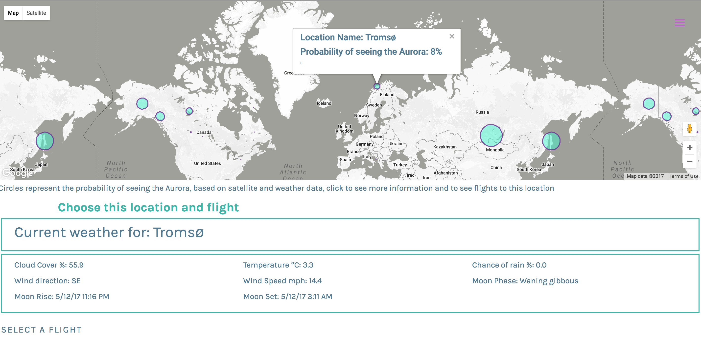
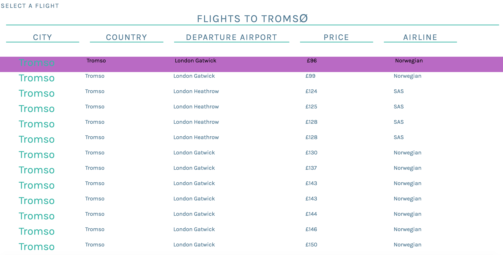
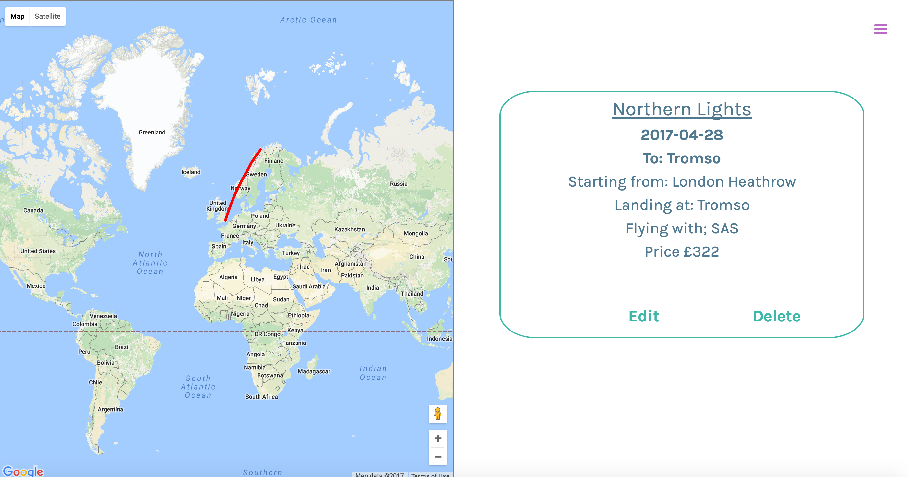

### Aurora Explorer
## WDI 25 Project Four. Sarah Miller Individual Project

Aurora Explorer is a travel app, intended for people to see the place on Earth with the highest chance of seeing an Aurora and investigate the cost of flights to this location. The app is based around the Auroras Live and Skyscanner APIs.

The app is built using Rails for the back-end, and an Angular front end  and is hosted on Heroku as separate apps as follows;

Rails API: https://polar-garden-45472.herokuapp.com

Angular App: https://pure-river-60301.herokuapp.com

## Installation Instructions

In order to run this app locally, first install the node packages by typing `npm i` in the terminal. Then install AngularJS dependencies by typing `bower install`.
Gulp is used for tooling, all tasks are contained within the 'tasks' folder.

## Functionality

This app uses a Postgresql database with the Active Record ORM in Rails. Four database tables exist, Trips, Users, Locations and Probabilities. The first has full CRUD actions for trips created by the users, and is referenced against the user model. Locations contains details of Aurora hunting locations including Latitude and Longitudes which are parsed into the Auroras Live API to obtain the probability data. The Probabilities table stores information downloaded from the API request, thus allowing the results from the request, which is slow to respond, to be made at a scheduled interval and then cached to allow a faster response from the app, and prevent large amounts of data being downloaded everytime the app is accessed.

Rails is used to make proxy requests to the APIs using HTTParty to avoid CORS issues, in addition to serving data from the Postgresql database.

The front end app is built in Angular V1, details of the set up can be found at the end of this document.

Both apps, are fully authenticated, using JWT with Bcrypt for authentication and hashing passwords.

## Technologies Used
* Aurora Explorer is built using a Ruby on Rails API on the back-end and an AngularJS Front-end consuming this API.
* A Postgresql database is used with ActiveRecord.
* Authentication uses JWT with Satellizer and BCrypt.
* HTTParty was used to make proxy requests to the APIs
* AngularJS was used on the front end to direct the API data and render the views.
* UI Router was incorporated in order to build the app with multiple pages.
* UI Bootstrap was used to provide grid layouts and additional functionality including Modals.
* Google Maps API is used to display maps and Autocomplete.
* The Auroras Live API was used to provide the Auroras and weather information. This API incorporates data from NASA's ACE satellite and weather forecasts from the Norwegian Met Office.
* Styles were written in Sass.
* Gulp was used as taskrunner.
* The google web fonts 'Karla' and 'Space Mono' were used to style the app.
* High resolution images are from Unsplash.com.

## User Journey

The homepage displays information about the app and directs the user to register as a new user or to log in to their existing account.

Once logged in the user is directed to the Trips Index page, which displays only the trips created by the current user, it is not possible to view trips created by all users. The user can view their trip or create a new one.

The process of creating a new trip starts on the new trip page where a name for the trip, the date and the starting location is input using google autocomplete. Autocomplete allows the Latitude and Longitude values to be parsed into the Skyscanner API request.

The user is then directed to the Edit page, here a map of current locations with a chance of viewing the Aurora is presented, the user can click on the location to get weather information for that location and to see flights to the closest airport from airports close to the starting location they previously entered.

The show page shows the full details of the trip including the flight selected by the user and the price of that flight.

## Future functionality
Additional functionality that could be incorporated into the app includes;
* Return journey planning
* More information about flights, including dates, and legs if a direct flight is not possible.
* Options to book accommodation and car hire at the selected destination.
* More data about the Aurora, including the four hour forecasts.

## Bugs and Improvements
The current app was built in a week and has several bugs;
* The scheduler for the probability request has not yet been set up on the deployed version, thus the probabilities information is static at the current time.
* The user experience of the Edit page could be improved, currently the page is not intuitive to use and is cluttered with information
* On the homepage the more information modal has not yet been implemented.
* Ng-Messages was used for form validation for the Login and Registration forms, and the messages are currently not displaying properly.
